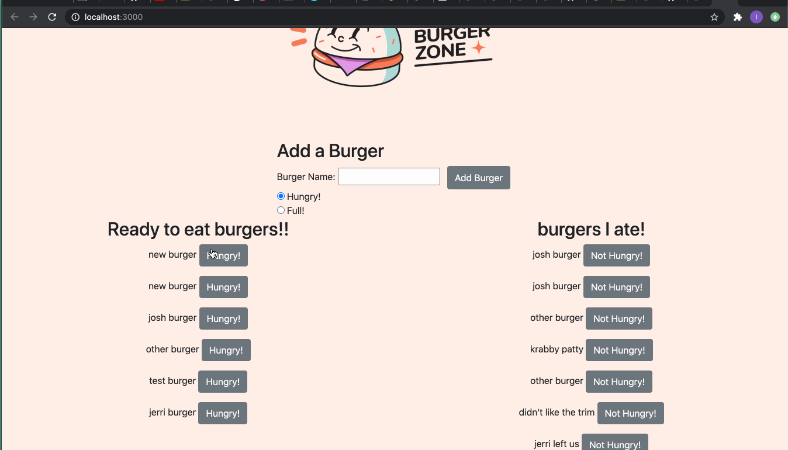

# Ivans-Burger-Joint


## Table of Contents
* [Description](#Description)
* [Technologies](#Technologies)
* [Features](#Features)
* [Author](#Author)
* [Credits](#Credits)
* [License](#License)

## Description 
Hi! Welcome to my Burger Joint Website. Ivan's Burger Joint is a burger logger which was built with MySQL, Node, Express, Handlebars and ORM that is built within the application. 
With some handlebars magic and html I was able to build the front end of the page and through Node and MySql I was able to query data into the app. Here you are able to add a burger to the joint and set it ready to be eaten and then DEVOUR it, by changing the locations of the burger. Using Heroku and JawsDb I was able to connect my data base and deploy the website. 


## Technologies
* [JavaScript](https://www.w3schools.com/js/)
* [MySQL](https://www.mysql.com/)
* [Handlebars](https://handlebarsjs.com/)
* [Express](https://expressjs.com/)
* [JawsDB](https://elements.heroku.com/addons/jawsdb)
* [jQuery](https://jquery.com/)
* [HTML](https://www.w3schools.com/html/)
* [CSS](https://www.w3schools.com/css/)

## Features


* So I will start out with some good ol' handlebars code. Here I am able to generate a front end by connecting to jquery through my main.handlebars page. But But the interesting part is the handlebars syntax which I mainly used to generate multiple buttons with the #each at the button of the page. The button is living within the burger.block.handlebars file. 
```

<div class="row d-flex justify-content-center">
<h1>Burgers!</h1>
</div>

<div class="row d-flex justify-content-center">

</div>


<div class="row d-flex justify-content-center">
<form class="create-form">
          <h2>Add a Burger</h2>
          <label for="new-burger">Burger Name:</label>
          <input type="text" id="new-burger" name="burger_name">
   
<button class="btn btn-secondary ml-2 addBurgerBtn" type="submit">Add Burger</button>
          <label for="devoured"></label><br>
          <input type="radio" name="devoured" value="0" checked> Hungry!<br>
          <input type="radio" name="devoured" value="1"> Full!
  
</form>

</div>


<div class="d-flex justify-content-center">
  <div class="col text-center">
    <h2>Ready to eat burgers!!</h2>
    <div>
      {{#each burgers}}
      {{#unless devoured}}
      {{> burgers/burger-block devour=true}}
      {{/unless}}
      {{/each}}
    </div>
  </div>


  <div class="col text-center">

    <h2>burgers I ate!</h2>
    <div>
      {{#each burgers}}
      {{#if devoured}}
      {{> burgers/burger-block devour=false}}
      {{/if}}
      {{/each}}
    </div>
  </div>

</div>
  ```


* ORM 
* Here is where we store all of our SQL commands. Be cause of this ORM  we are able to just simply require this file and call the functions to create, find all, and update our data. This allows us to let this live in this file and not be repetetive making commands for MySql. 

```

var connection = require("../config/connection.js");

var orm = {
  all: function(tableInput, cb) {
    var queryString = "SELECT * FROM " + tableInput + ";";
    connection.query(queryString, function(err, result) {
      if (err) {
        throw err;
      }
      cb(result);
    });
  },
  create: function(table, cols, vals, cb) {
    var queryString = "INSERT INTO " + table;

    queryString += " (";
    queryString += cols.toString();
    queryString += ") ";
    queryString += "VALUES (";
    queryString += printQuestionMarks(vals.length);
    queryString += ") ";

    console.log(queryString);

    connection.query(queryString, vals, function(err, result) {
      if (err) {
        throw err;
      }

      cb(result);
    });
  },

  update: function(table, objColVals, condition, cb) {
    var queryString = "UPDATE " + table;

    queryString += " SET ";
    queryString += objToSql(objColVals);
    queryString += " WHERE ";
    queryString += condition;

    console.log(queryString);
    connection.query(queryString, function(err, result) {
      if (err) {
        throw err;
      }

      cb(result);
    });
  }
};

// Export the orm object for the model (cat.js).
module.exports = orm;

```

* Controller!
* This code comunicates between the user and the data base recieving all the api calls and communicating back to the data base. 

```
var express = require("express");

var router = express.Router();

// Import the model to use its database functions.
var burger = require("../models/burger.js");

// Create all our routes and set up logic within those routes where required.
router.get("/", function(req, res) {
  burger.all(function(data) {
    var hbsObject = {
      burgers: data
    };
    console.log(hbsObject);
    res.render("index", hbsObject);
  });
});

router.post("/api/burgers", function(req, res) {
   if (req.body.burger_name != "") {
  burger.create([
    "burger_name", "devoured"
  ], [
    req.body.burger_name, req.body.devoured
  ], function(result) {
    // Send back the ID of the new quote
    res.json({ id: result.insertId });
  });
 }
});

router.put("/api/burgers/:id", function(req, res) {
  var condition = "id = " + req.params.id;

  console.log("condition", condition);

  burger.update({
    devoured: req.body.devoured
  }, condition, function(result) {
    if (result.changedRows == 0) {
      // If no rows were changed, then the ID must not exist, so 404
      return res.status(404).end();
    } else {
      res.status(200).end();
    }
  });
});

// Export routes for server.js to use.
module.exports = router;


```


## Installation
In Order to install the dependencies you have to do a 
```
mpm install
```
In order to run the code you have to type this in your terminal. 

```
node server.js
```

This is deployed but if you wanted to run through express you have to use this.  
```
var PORT = process.env.PORT || 8080;
```

## Author
Ivan Torres
* [GitHub-Repo](https://github.com/IvanTorresMia/READme-project-Ivan)
* [linkedIn](www.linkedin.com/in/ivan-torres-0828931b2)
* [Portfolio](www.linkedin.com/in/ivan-torres-0828931b2)

## Credits
* Credits for this homework assignment go out to Jerome, Manuel, Kerwin, Roger, and all of my classmates who helped me in study sessions. As well as my tutor who helped me a ton with understanding this homework assignment. 
* [StackOverFlow](https://stackoverflow.com/)


## License]
[MIT](https://choosealicense.com/licenses/mit/#) license 